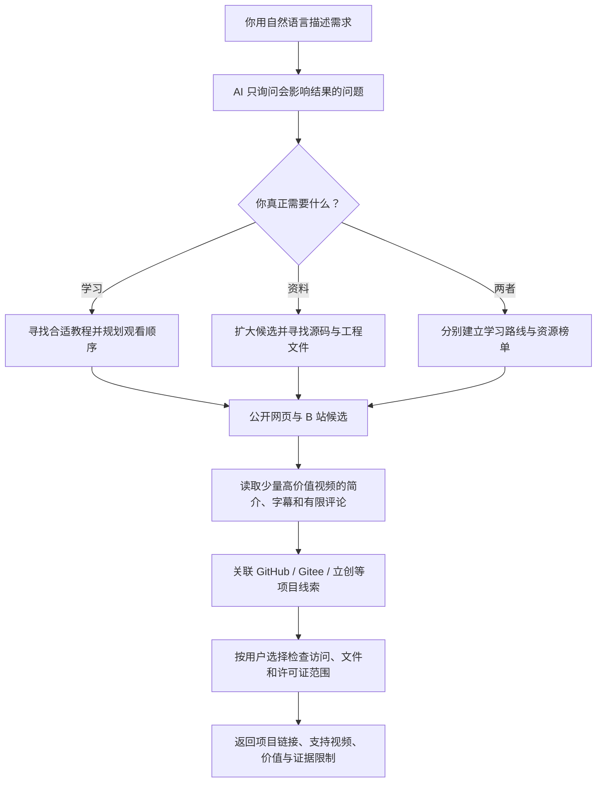

<div align="center">

# Bilibili Technical Resource Discovery

### 不知道关键词，也不知道资源藏在哪里？直接告诉 AI 你想学什么、想做什么。

它会先问清你的目标，再从 **B 站视频、简介、字幕、有限评论和公开项目平台**中，
寻找真正有用的教程、源码、PCB、设计资料与技术路线。

[](https://www.python.org/)
[](https://github.com/sunwanxu/bilibili-tech-resource-discovery/releases/tag/v1.0.0)
[](LICENSE)
[](skills/bilibili-tech-resource-discovery)

**[一分钟安装](#一分钟安装)** · **[看看怎么用](#三个真实使用场景)** · **[它会返回什么](#它会返回什么)** · **[工作原理](#它是怎么工作的)**

</div>

---

## 这是什么？

普通搜索往往只返回“标题里看起来相关”的视频。本项目更关心视频背后有没有能真正帮助你的东西：

- 如果你想学习，它会根据你的基础挑选教程，并给出观看顺序；
- 如果你想做项目，它会优先寻找源码、PCB、原理图、BOM、固件、报告和设计资料；
- 如果你只是想拓展思路，它会扩大搜索范围，比较不同方案，而不是只给一个答案；
- 如果需求还很模糊，它会先问几个简单问题，不要求你自己想关键词。

> **它不是单纯的视频推荐器，也不是普通的链接搜索器。**<br>
> 它会先理解你要“学习”“寻找可复用资料”，还是“两者都要”，再决定怎么搜索和检查。

## 三个真实使用场景

| 你的情况 | 你可以直接这样说 | 它应该帮你得到什么 |
|---|---|---|
| 🧩 零基础学习 | “我完全不会画 PCB，想用嘉立创 EDA 画 STM32F103C8T6 最小系统板。” | 适合当前水平的视频顺序、能打开的工程、原理图/PCB/BOM 是否齐全 |
| 🏆 搜索比赛资料 | “寻找 2026 电赛 H 题的开源资料，我想比较不同设计方案。” | 精确题目对应的视频与项目、代码/硬件/报告线索、各方案价值及缺失证据 |
| 🎬 探索新方向 | “我想学习 AI 短剧制作，但不知道从哪里开始。” | 根据软件基础和目标生成学习路线，区分入门教程、完整案例和可复用工作流 |

你不需要先知道题目全称、仓库名称、搜索关键词或命令行参数。

### 一次真实测试是什么样的？

下面是 v1.0 发布前“2026 电赛 H 题”测试的简化记录，不是预设演示数据：

> **用户：** 我想要关于 2026 电赛 H 题的开源资料。<br>
> **AI：** 这次想学习、搜索资料，还是两者都要？<br>
> **用户：** 搜索资料。<br>
> **AI：** 想精选少量结果，还是大约 10–20 个标准结果？需要检查链接和许可证吗？<br>
> **用户：** 标准数量，不检查；只要严格对应 2026 H 题。

这次受限搜索识别到题目“车载平衡滚球运动控制系统”，获得 **40 个视频候选**、
选择 **15 个相关候选**，并对排名靠前的视频读取了可用的简介、字幕和有限评论；同时整理出
公开项目线索。因为用户选择“不检查”，结果会明确标记为“公开线索、尚未验证许可证”，不会
把“公开仓库”直接写成“确认开源”。

## 一分钟安装

### 推荐：直接交给 Codex 或 OpenCode

复制下面这段话，发给你的 AI：

```text
请从 https://github.com/sunwanxu/bilibili-tech-resource-discovery 安装最新版
bilibili-tech-resource-discovery Skill。请自行识别当前环境并完成安装。

安装前先问我是否登录 B 站；如果我同意，只打开项目独立的 Edge 窗口让我正常登录。
不要让我安装 Firefox、导出或粘贴 Cookie、提供 API Key、设置 PYTHONPATH，
也不要让我手工排查 Python 环境。

安装完成后，请确认运行版本、登录状态，以及我是否可以直接用自然语言搜索。
```

AI 会自动识别 Codex 或 OpenCode，安装 Skill 自带的私有运行环境，并验证版本。第一次使用
登录模式时，只需要在弹出的独立 Edge 窗口中正常登录 B 站。

- 不需要安装 Firefox；
- 不需要 Cookie 导出插件；
- 不需要把 Cookie 或 API Key 发给 AI；
- 不读取你的日常 Edge Profile；
- 不配置 Firecrawl 也能开始使用。

> [!TIP]
> 安装后不需要学习任何命令。直接说“我想学……”或“帮我找……”即可。

<details>
<summary><strong>从本地文件夹或源码安装</strong></summary>

可独立分发的 Skill 文件夹是：

```text
skills/bilibili-tech-resource-discovery
```

把整个文件夹交给 Codex 或 OpenCode，并让它安装。仓库根目录也提供统一入口：

```powershell
python install.py
```

安装器会保留已有的项目托管登录，使用普通 wheel 安装私有运行环境，并验证：

```text
Runtime verified: bhka 1.0.0
```

</details>

## 装好以后怎么说？

像平常聊天一样描述需求即可：

```text
我是零基础，想学习用嘉立创画 STM32F103C8T6 最小系统板。
```

```text
我已经做完一个电赛方案，想再找 20 个不同路线的公开项目拓展思路，
只检查最重要的几个。
```

```text
帮我找 ESP32-C3 MQTT 智能家居的开源实现，优先代码、PCB 和文档都比较完整的。
```

AI 会根据问题逐步询问最重要的信息，例如：

1. 这次要学习路线、开源资料，还是两者都要？
2. 想精选少量结果，还是大量探索灵感？
3. 是否检查链接、文件和许可证？检查核心结果还是全部检查？
4. 只有确实影响结果时，才继续询问基础水平、固定型号、软件版本或成果形式。

如果不想继续回答，直接说 **“先搜再说”** 或 **“直接搜索”**，它会使用稳定默认值开始。

## 它会返回什么？

### 学习模式

- 三到五个优先观看的视频；
- 为什么适合你的当前水平；
- 推荐观看顺序和每一步要学会什么；
- 可以配套练习的项目或工程文件；
- 其他值得保留的替代教程。

### 资源搜索模式

- 可以直接打开的项目和资料链接；
- 源码、PCB、原理图、BOM、Gerber、固件、报告分别是否找到；
- 项目与需求是精确匹配、部分参考，还是仅适合寻找灵感；
- 是否找到许可证，以及许可证究竟覆盖整个项目还是某个组件；
- 支持判断的 B 站视频，以及证据来自简介、字幕还是有限评论；
- 需要登录、加入群组或人工打开的资源也会保留，但会明确标记。

### 两者都要

先给出学习路线，再单独列出可复用资源。教学很好的视频不会因为没有源码而被丢掉，公开项目
也不会因为视频热度低而被埋没。

## 它和普通搜索有什么不同？

| 普通视频搜索 | 本项目 |
|---|---|
| 需要用户自己想关键词 | 先通过简短问答理解目标和限制 |
| 主要看标题、播放量 | 分开评价教学价值与资源价值 |
| 找到视频就结束 | 继续寻找简介、字幕、评论中的项目入口 |
| “作者说开源”就可能被当作开源 | 区分公开可见、声称开源和许可证已验证 |
| 很难知道 PCB、BOM、源码是否齐全 | 按所需工程文件逐项记录已发现与未证实内容 |
| 多次失败后只能重新开始 | 缓存候选和已完成证据，保留阶段性结果 |

## 它是怎么工作的？



候选发现尽量保持广，昂贵的深度读取只用于排名靠前的视频。相同搜索词、视频和项目证据会
分段缓存，重复任务优先复用已有结果。

## “公开”不等于“确认开源”

这是本项目最重要的边界之一：

| 标记 | 含义 |
|---|---|
| **许可证已验证** | 找到了明确许可证，并能说明它覆盖哪些代码或文件 |
| **公开可访问，许可证未确认** | 能看到或下载源码，但暂时没有足够授权证据 |
| **平台或作者声称开源** | 有开源声明，仍需要进一步检查具体条款或链接 |
| **共享资料，授权不明确** | 网盘、群文件或登录后资源，可作为线索但不能直接认定开源 |
| **仅声称/承诺开源** | 视频提到会开源，但尚未找到能验证的项目入口 |

单个软件组件使用 GPL、MIT 等许可证，不代表整套比赛方案、PCB、结构文件和共享资料都采用
同一许可证。

## 登录、隐私与平台限制

登录不是搜索的强制条件，但登录后通常能提高字幕、评论和部分视频的可访问性。Skill 使用
项目独立的 Edge 登录窗口，状态只保存在本机。

- `.env`、`.auth/`、Cookie、API Key、原始数据和报告不会进入 Git；
- 不要求用户在聊天中发送凭据；
- 默认不输出上传者或评论者身份；
- 评论读取有明确上限，不进行无限翻页；
- 不使用验证码绕过、代理轮换、账号轮换或激进重试；
- B 站返回 HTTP 412 时，立即停止本轮剩余 B 站请求并保留已有结果；
- 412 期间仍可继续公开网页和项目平台搜索。

## 当前适合谁？

- 不知道应该用什么关键词的技术学习者；
- 想从零学习 PCB、嵌入式、软件、AI、机械或其他技术方向的人；
- 想寻找比赛方案、源码、工程文件和报告的学生；
- 已经完成一个方案，希望比较其他路线的开发者；
- 希望 AI 明确说明“为什么推荐”和“证据还缺什么”的用户。

当前优先保证 **Windows + Codex/OpenCode** 的安装和使用体验。独立 Web 页面仍在规划中。

<details>
<summary><strong>开发者信息</strong></summary>

### 技术组成

- Python 3.11+
- `yt-dlp`：可替换的 B 站数据适配层
- Playwright：项目独立的 Edge 登录和正常搜索页面
- Pydantic：结构化意图、证据与报告契约
- SQLite：候选、视频证据和项目检查缓存

### 本地开发

```powershell
git clone https://github.com/sunwanxu/bilibili-tech-resource-discovery.git
cd bilibili-tech-resource-discovery
python -m venv .venv
.\.venv\Scripts\python -m pip install -e ".[dev]"
Copy-Item .env.example .env
.\.venv\Scripts\python -m pytest
.\.venv\Scripts\python -m ruff check .
```

所有自动化测试均使用离线假数据，不访问 B 站。

### 命令入口

Skill 使用稳定的自然语言执行入口：

```powershell
.\.venv\Scripts\bhka-v1 --help
.\.venv\Scripts\bhka-v1 login --project-root .
.\.venv\Scripts\bhka-v1 discover "自然语言技术需求" --mode resource --project-root .
```

旧版兼容与单视频诊断入口仍保留为 `bhka`：

```powershell
.\.venv\Scripts\bhka --version
.\.venv\Scripts\bhka auth-status --json --project-root .
.\.venv\Scripts\bhka analyze BVxxxxxxxxxx --summary-json --project-root .
```

主源码位于 `src/bhka/`；可独立分发的 Skill 位于
`skills/bilibili-tech-resource-discovery/`，其中包含自己的 runtime。测试会校验两份源码，
避免开发版本和分发版本漂移。

### 可选 Firecrawl 增强

Firecrawl 不是首次使用的前置条件。配置 `FIRECRAWL_API_KEY` 后可以扩大公开网页覆盖；没有
Key、服务不可用或无有效结果时，宿主 AI 和内置公开索引仍可继续提供候选。

</details>

## 当前状态

- [x] 自包含 Codex / OpenCode Skill
- [x] 根据用户问题渐进式询问需求
- [x] 学习、资源搜索和混合模式
- [x] 独立 Edge 托管登录
- [x] B 站简介、字幕和有限评论读取
- [x] GitHub / Gitee / 立创等公开项目线索
- [x] 工程文件与许可证作用域判断
- [x] 分段缓存、结构化报告和 HTTP 412 全局熔断
- [ ] 更丰富的公开网页索引适配器
- [ ] 可复现的跨领域检索评测集
- [ ] 面向普通用户的 Web 界面

## 参与贡献

欢迎提交搜索失败样例、误召回案例和新的公开项目平台适配建议。请勿在 Issue 中附带 Cookie、
API Key、完整字幕、私人评论数据或账户身份信息。

## License

[MIT](LICENSE) © 2026 [sunwanxu](https://github.com/sunwanxu)
