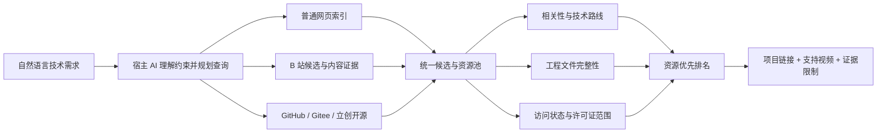

<div align="center">

# Bilibili Technical Resource Discovery

### 从自然语言需求出发，找到真正可复用的开源技术资产

不止搜索视频。联合网页索引、B 站内容证据与开源项目平台，发现、验证并排序源码、PCB 工程、设计资料和技术路线。

[](https://www.python.org/)
[](https://github.com/sunwanxu/bilibili-tech-resource-discovery)
[](LICENSE)
[](skills/bilibili-tech-resource-discovery)

</div>

---

## 项目定位

技术搜索最难的部分通常不是“找到一个相关视频”，而是回答这些问题：

- 视频背后有没有可以下载和复用的源码或工程？
- 所谓“开源”是否真的有仓库和许可证证据？
- PCB、原理图、BOM、Gerber、固件和文档是否完整？
- 资源是否适合当前能力，而不是只在标题里命中关键词？
- 简介没有链接时，评论或字幕里是否藏着项目名、仓库或资料入口？

本项目把**可用的工程资源**视为主要结果，把 B 站视频视为发现入口、讲解材料和交叉验证证据。一个包含可验证项目链接的视频，通常应当优先于一个热度更高但没有可复用资产的视频。

> [!IMPORTANT]
> 项目不会把“可以下载”自动判定为“具有开源许可证”，也不会用单个组件的许可证代表整套方案。

## 核心能力

| 能力 | 说明 |
|---|---|
| 自然语言需求理解 | 从目标、技术栈、型号、平台、能力水平和资源偏好生成搜索计划 |
| 多源候选发现 | 联合普通网页索引、B 站搜索、GitHub、Gitee、立创开源平台及公开项目站点 |
| B 站证据读取 | 获取可用的视频元数据、简介、字幕和有上限的评论样本 |
| 隐藏链接挖掘 | 从简介、评论和字幕中提取仓库、硬件项目、文档、网盘和受限资源线索 |
| 工程完整性验证 | 独立检查源码、原理图、PCB、BOM、Gerber、固件、文档和实物验证信号 |
| 许可证作用域判断 | 区分已验证许可证、公开但未授权、平台声明、共享文件和仅声称开源 |
| 资源优先排序 | 先按可访问性、工程价值和许可证证据排序资源，再关联支持视频 |
| 风控与失败语义 | 提供 HTTP 412 全局熔断、自适应冷却、非零失败退出码和结构化运行状态 |
| 隐私保护 | 登录状态、Cookie、API Key、原始数据和报告仅保存在本地忽略目录 |

支持 `BV...`、`av...`、纯数字 aid 和完整 B 站视频链接。纯数字 aid 会自动规范为可直接交给 `analyze` 的 `av...` 格式。

## 工作原理



### 证据分层

项目不会假装“完整看过视频”，而是明确记录判断来自哪里：

1. **项目平台证据**：仓库文件、Release、许可证、硬件工程页面。
2. **视频简介证据**：作者公开的项目说明、链接和资料入口。
3. **字幕证据**：可访问字幕中提到的实现路线、项目名和资源线索。
4. **评论证据**：有限顶层评论及回复中的补充链接和使用反馈。
5. **元数据证据**：标题、发布时间、互动指标和分 P 信息。
6. **人工复核线索**：需要登录、加入群组或打开特定应用的资源。

## 快速开始：作为 Agent Skill 使用

可分发 Skill 是一个自包含文件夹：

```text
skills/bilibili-tech-resource-discovery
```

把整个文件夹交给 Codex 或 OpenCode，然后只需要说：

```text
请安装这个 Skill。安装完成后，如果需要登录 B 站，请引导我完成登录。
```

Skill 自带运行源码和跨客户端安装器，不依赖仓库其他目录。首次需要登录时会打开独立 Edge 窗口，用户只需使用正常方式登录 B 站：

- 不需要 Firefox；
- 不需要 Cookie 导出插件；
- 不需要把 Cookie 或 API Key 发给 AI；
- 不读取日常 Edge Profile 的加密 Cookie 数据库。

安装器会验证实际执行的是 Skill 自带版本：

```text
Runtime verified: bhka 0.3.0
```

> [!TIP]
> 安装后无需学习命令行。直接描述想做什么、当前水平和希望获得的资源即可。

## 自然语言使用示例

```text
我完全不会画 PCB，帮我寻找适合零基础的嘉立创 EDA 教程，
优先返回带完整 STM32 最小系统板工程的项目。
```

```text
帮我寻找 ESP32-C3 MQTT 智能家居的开源实现，
比较不同架构，并告诉我代码、PCB 和文档是否完整。
```

```text
寻找射频功率放大器 ADS 仿真的设计方案。
我想要可复现项目、不同技术路线和讲解清晰的视频。
```

```text
我已经完成一个比赛方案，想拓展视野。
请寻找其他公开实现，重点比较设计思路、代码和硬件差异。
```

典型结果会优先列出：

- 可直接访问的项目链接；
- 资源与需求的匹配价值；
- 已发现和未被证实的工程文件；
- 开源状态及许可证证据范围；
- 支持该资源的 B 站视频；
- 登录要求、失效风险和人工复核项；
- 精确方案、部分参考或设计灵感的区别。

## 资源评价模型

资源按证据强度和可复用性分层，而不是简单计算关键词数量：

| 优先级 | 资源状态 |
|---:|---|
| 1 | 项目可访问、许可证已验证、关键工程文件与需求匹配 |
| 2 | 公开源码或硬件工程可访问，但许可证仍需确认 |
| 3 | 平台声明开源或许可证，具体条款需要复核 |
| 4 | 网盘、群文件或登录后可见资源，授权范围不明确 |
| 5 | 作者声称或承诺开源，但尚未找到可验证链接 |

视频价值与资源价值分开计算。教学清晰但没有工程文件的视频仍可作为学习材料，但不会自动进入“可用开源项目”第一梯队。

## 源码开发

### 环境

- Python 3.11+
- Windows 为当前重点验证平台
- `yt-dlp` 负责可替换的 B 站数据适配
- Playwright 负责隔离的托管 Edge 登录
- Pydantic 定义持久化与报告契约

### 安装与验证

```powershell
git clone https://github.com/sunwanxu/bilibili-tech-resource-discovery.git
cd bilibili-tech-resource-discovery
python -m venv .venv
.\.venv\Scripts\python -m pip install -e ".[dev]"
Copy-Item .env.example .env
.\.venv\Scripts\python -m pytest
.\.venv\Scripts\python -m ruff check .
```

所有自动化测试均使用离线假数据，不访问 B 站。

### 常用 CLI

```powershell
.\.venv\Scripts\bhka --version
.\.venv\Scripts\bhka login --project-root .
.\.venv\Scripts\bhka auth-status --json --project-root .
.\.venv\Scripts\bhka discover "自然语言技术需求" --project-root .
.\.venv\Scripts\bhka analyze BVxxxxxxxxxx --summary-json --project-root .
```

`--summary-json` 是隐私友好的冒烟测试模式：只输出元数据成功状态、字幕轨道与字符数、评论数量及标准化错误码，不调用可选 AI 分析器，也不输出字幕或评论正文。

AI 分析器是可选能力。没有 OpenAI 或 DeepSeek API Key 时，搜索、资源提取、字幕和评论读取仍可工作；单视频评价会使用明确标记的启发式基线。

## 项目结构

```text
.
├─ skills/bilibili-tech-resource-discovery/  # 可独立分发的 Agent Skill
│  ├─ SKILL.md                               # Agent 工作流与行为边界
│  ├─ references/                            # 登录和证据规范
│  ├─ scripts/install.py                     # Codex / OpenCode 安装器
│  └─ runtime/                               # Skill 自带 Python 运行时源码
├─ src/bhka/                                 # 主开发源码
│  ├─ source.py                              # 唯一 B 站数据适配层
│  ├─ discovery.py                           # 查询、候选、资源池与排名
│  ├─ storage.py                             # 报告、状态与隐私化持久化
│  └─ cli.py                                 # CLI 与结构化失败语义
├─ tests/                                    # 全离线回归测试
└─ docs/                                     # 架构、决策与研究记录
```

主源码与 Skill bundled runtime 由测试逐文件校验，防止发布包和开发版本发生漂移。

## 风控、隐私与合规边界

- `.env`、`.auth/`、Cookie、API Key、`data/` 和 `reports/` 不进入 Git。
- 登录状态只保存在本机安装目录，不复制进 Skill 分发包。
- 不批量抓取、不绕过验证码、不轮换账户或代理规避平台限制。
- HTTP 412 会停止本轮全部 B 站直连请求，包括搜索、预览、字幕和评论。
- 客户端采用 5 / 15 / 30 分钟自适应冷却；它不是 B 站官方倒计时。
- 冷却期间仍可继续普通网页索引和公开项目平台搜索。
- 评论读取有明确数量上限，缺失字幕或评论不会被伪造成完整证据。
- 受限资源会保留为人工复核线索，不会被错误标记为公开可用。

请在使用时遵守 B 站平台规则、资源作者的许可证与适用法律。

## 当前状态与路线图

项目仍处于早期可用阶段，当前重点是让技术资源搜索“证据透明、结果可复用、安装不劝退”。

- [x] 自包含 Codex / OpenCode Skill
- [x] 独立 Edge 托管登录与状态验证
- [x] B 站简介、字幕和有限评论读取
- [x] GitHub / Gitee / 立创开源资源聚合
- [x] 工程文件与许可证作用域判断
- [x] HTTP 412 全局熔断与自适应冷却
- [x] 结构化报告、失败语义和隐私化摘要
- [ ] 更丰富的公开网页索引适配器
- [ ] 可配置的资源评分策略与领域模板
- [ ] 面向普通用户的 Web 界面
- [ ] 可复现的跨领域检索评测集

## 参与贡献

欢迎提交 Issue、搜索失败样例、误召回案例和新的公开项目平台适配建议。提交问题时请勿附带 Cookie、API Key、完整字幕、私人评论数据或账户身份信息。

开发贡献请确保：

1. 测试保持离线、确定且不访问 B 站；
2. 不引入批量抓取、认证绕过或未公开协议实现；
3. 新的持久化字段具有明确证据来源和隐私边界；
4. 修改主源码后同步 bundled runtime，并通过完整测试。

## License

[MIT](LICENSE) © 2026 [sunwanxu](https://github.com/sunwanxu)
